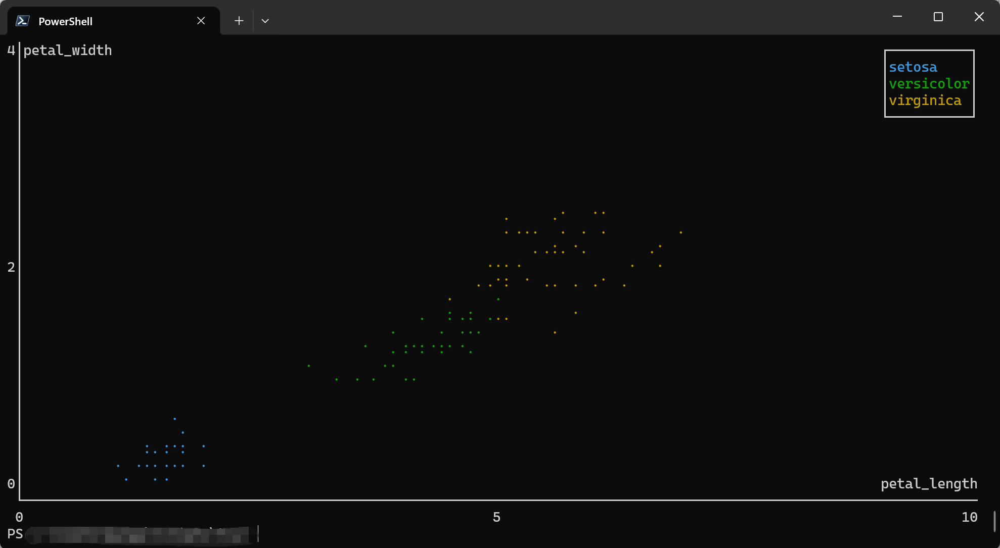
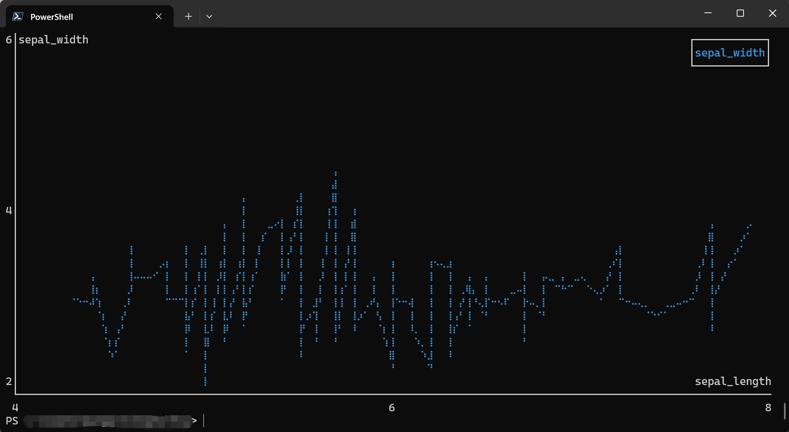
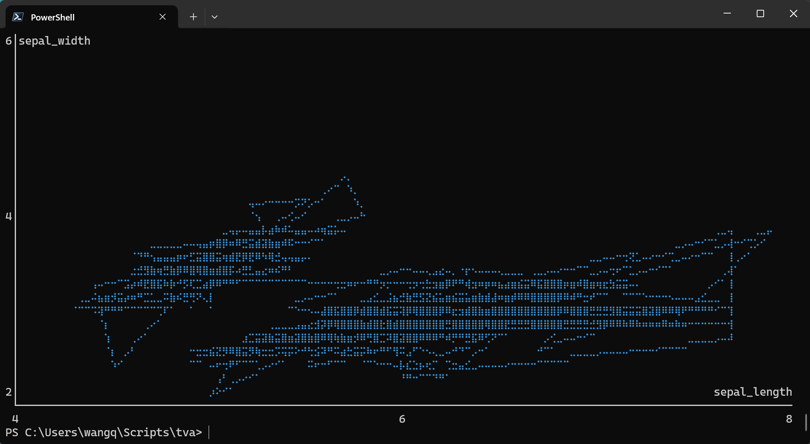
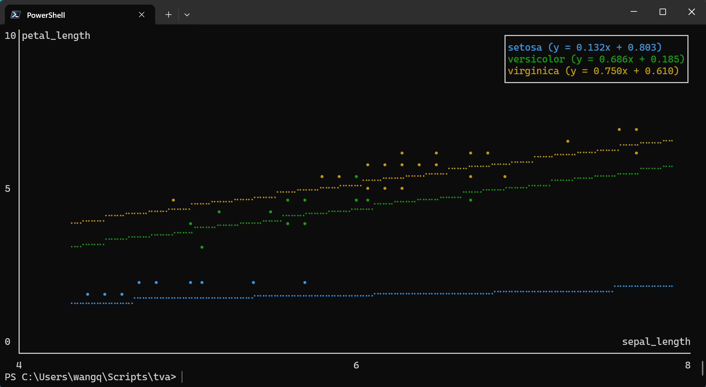
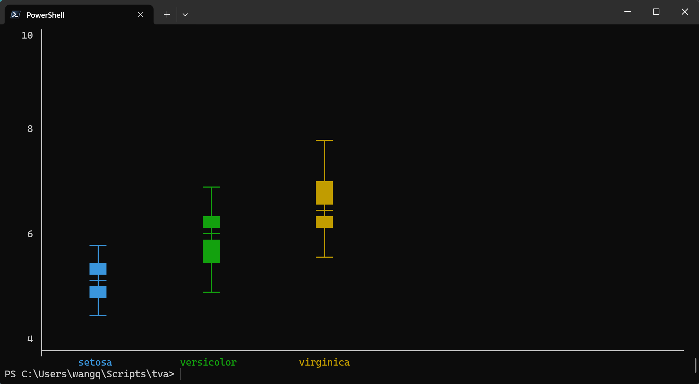
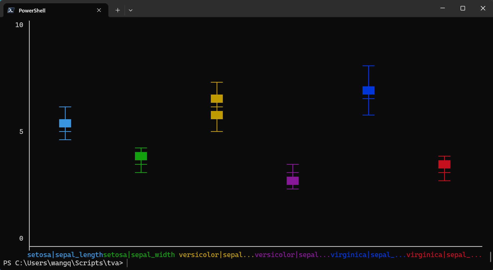

# Plotting Documentation

This document explains how to use the plotting commands in `tva`: **`plot point`**. These commands bring data visualization capabilities to the terminal, inspired by the grammar of graphics philosophy of `ggplot2`.

## Introduction

Terminal-based plotting allows you to quickly visualize data without leaving the command line. `tva` provides plotting tools that render directly in your terminal using ASCII/Unicode characters:

*   **`plot point`**: Draws scatter plots or line charts from TSV data.
*   **`plot box`**: Draws box plots (box-and-whisker plots) from TSV data.

## `plot point` (Scatter Plots and Line Charts)

The `plot point` command creates scatter plots or line charts directly in your terminal. It maps TSV columns to visual aesthetics (position, color) and renders the chart using ASCII/Unicode characters.

### Basic Usage

```bash
tva plot point [input_file] --x <column> --y <column> [options]
```

*   **`-x` / `--x`**: The column for X-axis position (required).
*   **`-y` / `--y`**: The column for Y-axis position (required).
*   **`--color`**: Column for grouping/coloring points by category (optional).
*   **`-l` / `--line`**: Draw line chart instead of scatter plot.

### Column Specification

Columns can be specified by:
*   **Header name**: e.g., `-x age`, `-y income`
*   **1-based index**: e.g., `-x 1`, `-y 3`

## Examples

### 1. Basic Scatter Plot

The simplest use case is plotting two numeric columns against each other.

Using the `tests/data/plot/iris.tsv` dataset (Fisher's Iris dataset):

```bash
tva plot point tests/data/plot/iris.tsv -x sepal_length -y sepal_width
```

This creates a scatter plot showing the relationship between sepal length and sepal width.

Output (terminal chart):
```
6│sepal_width
 │
 │
 │
 │
 │
 │
 │
 │                                ⠠
 │                             ⡀
 │                       ⠂          ⢀
4│                     ⡀     ⠂    ⢀                                      ⢀   ⢀
 │                     ⠄   ⠄ ⠄
 │           ⠈     ⠁ ⠅ ⠄ ⠄     ⠄                                ⠁
 │           ⠈   ⠁   ⠅ ⠅ ⠁   ⠁          ⠈   ⠈ ⠨       ⠄
 │       ⠈   ⢈ ⠈ ⡀ ⡀ ⠁                ⠈         ⢈ ⠁   ⡀ ⠁ ⡁ ⠁   ⠁
 │     ⠐ ⢐       ⠂ ⠂ ⠂       ⠂  ⢐ ⢐   ⠐ ⢐ ⢐ ⢀ ⢀ ⢀ ⠂ ⡂ ⠂ ⠂     ⠂ ⠂⢀     ⠐ ⠐
 │                       ⡀      ⢐ ⠐ ⢐   ⢀ ⠐ ⠐ ⢐ ⢐ ⠂     ⠂          ⠐     ⠐
 │                             ⠂  ⠐ ⠐     ⠐                              ⠐
 │                 ⠅   ⠁       ⠅⠈ ⠈           ⠈       ⠁
 │         ⠈         ⠁         ⠁        ⠠   ⠠ ⠈
2│                   ⡀                                              sepal_length
 └──────────────────────────────────────────────────────────────────────────────
 4                                       6                                     8
```

### 2. Grouped by Category (Color)

Use the `--color` option to group points by a categorical column. Each unique value gets a different color.

```bash
tva plot point tests/data/plot/iris.tsv -x petal_length -y petal_width --color label --cols 1.0 --rows 1.0
```


This creates a scatter plot with three colors, one for each iris species (setosa, versicolor, virginica).

The output will show three distinct clusters with different markers/colors:
*   **Setosa**: Small petals, clustered at bottom-left
*   **Versicolor**: Medium petals, in the middle
*   **Virginica**: Large petals, at top-right

### 3. Line Chart

Use the `-l` or `--line` flag to connect points with lines instead of drawing individual points.

```bash
tva plot point tests/data/plot/iris.tsv -x sepal_length -y sepal_width --line --cols 1.0 --rows 1.0
```



```bash
tva plot point tests/data/plot/iris.tsv -x sepal_length -y sepal_width --path --cols 1.0 --rows 1.0
```



### 4. Using Column Indices

You can use 1-based column indices instead of header names:

```bash
tva plot point tests/data/plot/iris.tsv -x 1 -y 3 --color 5
```

This maps:
*   Column 1 (`sepal_length`) to X-axis
*   Column 3 (`petal_length`) to Y-axis
*   Column 5 (`label`) to color

### 5. Different Marker Styles

Choose from three marker types with `-m` or `--marker`:

```bash
# Braille markers (default, highest resolution)
tva plot point tests/data/plot/iris.tsv -x sepal_length -y sepal_width -m braille

# Dot markers
tva plot point tests/data/plot/iris.tsv -x sepal_length -y sepal_width -m dot

# Block markers
tva plot point tests/data/plot/iris.tsv -x sepal_length -y sepal_width -m block
```

### 7. Regression Line

Use `--regression` to overlay a linear regression line (least squares fit) on the scatter plot. This helps visualize trends in the data.

```bash
tva plot point tests/data/plot/iris.tsv -x sepal_length -y petal_length -m dot --regression
```

When combined with `--color`, a separate regression line is drawn for each group:

```bash
tva plot point tests/data/plot/iris.tsv -x sepal_length -y petal_length -m dot  --color label --regression --cols 1.0 --rows 1.0
```



Note: `--regression` cannot be used with `--line` or `--path`.

### 8. Handling Invalid Data

Use `--ignore` to skip rows with non-numeric values:

```bash
tva plot point data.tsv -x value1 -y value2 --ignore
```

## Detailed Options

| Option | Description |
| :--- | :--- |
| `-x <COL>` / `--x <COL>` | **Required.** Column for X-axis position. |
| `-y <COL>` / `--y <COL>` | **Required.** Column for Y-axis position. |
| `--color <COL>` | Column for grouping/coloring by category. |
| `-l` / `--line` | Draw line chart instead of scatter plot. |
| `--path` | Draw path chart (connect points in original order). |
| `-r` / `--regression` | Overlay linear regression line. |
| `-m <TYPE>` / `--marker <TYPE>` | Marker style: `braille` (default), `dot`, or `block`. |
| `--cols <N>` | Chart width in characters or ratio (default: `1.0`, i.e., full terminal width). |
| `--rows <N>` | Chart height in characters or ratio (default: `1.0`, i.e., full terminal height minus 1 for prompt). |
| `--ignore` | Skip rows with non-numeric values. |

## Comparison with R `ggplot2`

| Feature | `ggplot2::geom_point` | `tva plot point` |
| :--- | :--- | :--- |
| Basic scatter plot | `aes(x, y)` | `-x <col> -y <col>` |
| Color by group | `aes(color = group)` | `--color <col>` |
| Line chart | `geom_line()` | `--line` |
| Path chart | `geom_path()` | `--path` |
| Regression line | `geom_smooth(method = "lm")` | `--regression` |
| Faceting | `facet_wrap()` / `facet_grid()` | Not supported |
| Themes | `theme_*()` | Terminal-based only |
| Output | Graphics file / Viewer | Terminal ASCII/Unicode |

`tva plot point` brings the core concepts of the grammar of graphics to the command line, allowing for quick data exploration without leaving your terminal.

## `plot box` (Box Plots)

The `plot box` command creates box plots (box-and-whisker plots) directly in your terminal. It visualizes the distribution of a numeric variable, showing the median, quartiles, and potential outliers.

### Basic Usage

```bash
tva plot box [input_file] --y <column> [options]
```

*   **`-y` / `--y`**: The column(s) to plot (required). Can specify multiple columns separated by commas.
*   **`--color`**: Column for grouping/coloring boxes by category (optional).
*   **`--outliers`**: Show outlier points beyond the whiskers.

### Examples

#### 1. Basic Box Plot

The simplest use case is plotting a single numeric column.

Using the `tests/data/plot/iris.tsv` dataset:

```bash
tva plot box tests/data/plot/iris.tsv -y sepal_length --cols 60 --rows 20
```

This creates a box plot showing the distribution of sepal length values.

Output (terminal chart):
```
10│
  │
  │
  │
  │
 8│        ─┬─
  │         │
  │         │
  │         │
  │         │
  │        ███
 6│        ─┼─
  │        ███
  │        ███
  │         │
  │         │
  │        ─┴─
 4│
  ├─────────────────────────────────────────────────────────
      sepal_length
```

#### 2. Grouped Box Plot

Use the `--color` option to create separate box plots for each category:

```bash
tva plot box tests/data/plot/iris.tsv -y sepal_length --color label --cols 1.0 --rows 1.0
```


This creates three box plots side by side, one for each iris species (setosa, versicolor, virginica).

#### 3. Multiple Columns

Plot multiple numeric columns for comparison:

```bash
tva plot box tests/data/plot/iris.tsv -y "sepal_length,sepal_width" --color label --cols 1.0 --rows 1.0
```


This creates four box plots side by side, one for each measurement column.

#### 4. Show Outliers

Display outlier points that fall beyond the whiskers:

```bash
tva plot box tests/data/plot/iris.tsv -y petal_width --color label --outliers --cols 80 --rows 20
```

```
    4 │
      │
      │
      │
      │                                                ─┬─
    2 │                                                ─┼─
      │                            ─┬─                 ███
      │                            ─┼─                 ─┴─
      │                            ─┴─
      │         •
      │        ─┬─
    0 │        ─┴─
      │
      │
      │
      │
      │
   -2 │
      ├─────────────────────────────────────────────────────────────────────────
             setosa            versicolor           virginica
```

### Detailed Options

| Option | Description |
| :--- | :--- |
| `-y <COL>` / `--y <COL>` | **Required.** Column(s) to plot. Multiple columns can be comma-separated. |
| `--color <COL>` | Column for grouping by category. |
| `--outliers` | Show outlier points beyond whiskers. |
| `--cols <N>` | Chart width in characters or ratio (default: `1.0`). |
| `--rows <N>` | Chart height in characters or ratio (default: `1.0`). |
| `--ignore` | Skip rows with non-numeric values. |

### Comparison with R `ggplot2`

| Feature | `ggplot2::geom_boxplot` | `tva plot box` |
| :--- | :--- | :--- |
| Basic box plot | `aes(y = value)` | `-y <col>` |
| Grouped box plot | `aes(x = group, y = value)` | `-y <col> --color <group>` |
| Show outliers | `outlier.shape` | `--outliers` |
| Multiple variables | `facet_wrap()` or multiple geoms | `-y "col1,col2"` |
| Horizontal boxes | `coord_flip()` | Not supported |
| Fill color | `fill` aesthetic | Terminal-based only |

## `plot bin2d` (2D Binning Heatmap)

The `plot bin2d` command creates 2D binning heatmaps directly in your terminal. It divides the plane into rectangles, counts the number of cases in each rectangle, and visualizes the density using character intensity. This is a useful alternative to `plot point` in the presence of overplotting.

### Basic Usage

```bash
tva plot bin2d [input_file] --x <column> --y <column> [options]
```

*   **`-x` / `--x`**: The column for X-axis position (required).
*   **`-y` / `--y`**: The column for Y-axis position (required).
*   **`-b` / `--bins`**: Number of bins in each direction (default: 30, or `x,y` for different counts).
*   **`-S` / `--strategy`**: Automatic bin count strategy: `freedman-diaconis`, `sqrt`, `sturges`.
*   **`--binwidth`**: Width of bins (or `x,y` for different widths).

### Examples

#### 1. Basic 2D Binning

Using the `docs/data/diamonds.tsv` dataset (diamond physical dimensions):

This creates a heatmap showing the density distribution of diamond length (x) vs width (y). The output shows the concentration of diamonds in different size ranges.

For better visualization of the main data cluster, you can filter the data first:

```bash
cargo run --bin tva plot bin2d docs/data/diamonds.48.tsv -x x -y y
```

Output (terminal chart):
```
8│y                                                               ·░▒▓█ Max:3908
 │
 │                                                                    ··
 │                                                            ········
 │                                                            ·····
 │                                                     ·····
 │                                                  ···░░···
 │                                             ·····░░░···
 │                                        ·····▒▒▒··
 │                                        ···░░···
 │                                      ░░···
6│                                ···░░░··
 │                           ···░░···
 │                      ···  ·····
 │                      ···░░
 │                 ···▒▒···
 │          ··     ·····
 │       ·····▓▓▓··
 │  ···░░···░░···
 │  ···██····
 │  ······
4│··                                                                           x
 └──────────────────────────────────────────────────────────────────────────────
 4                                       6                                     8
```

#### 2. Custom Bin Count

You can control the size of the bins by specifying the number of bins in each direction:

```bash
# Same bins for both axes
tva plot bin2d docs/data/diamonds.48.tsv -x x -y y --bins 20

# Different bins for X and Y
tva plot bin2d docs/data/diamonds.48.tsv -x x -y y --bins 30,15
```

#### 3. Specify Bin Width

Or by specifying the width of the bins:

```bash
tva plot bin2d docs/data/diamonds.48.tsv -x x -y y --binwidth 0.5,0.5
```

#### 4. Automatic Bin Selection

Use a strategy to automatically determine the number of bins:

```bash
tva plot bin2d docs/data/diamonds.48.tsv -x x -y y --cols 1.0 --rows 1.0 -S freedman-diaconis
```

Available strategies:
*   `freedman-diaconis`: Based on data distribution (robust to outliers)
*   `sqrt`: Square root of number of observations
*   `sturges`: Sturges' formula (1 + log2(n))

### Detailed Options

| Option | Description |
| :--- | :--- |
| `-x <COL>` / `--x <COL>` | **Required.** X-axis column (1-based index or name). |
| `-y <COL>` / `--y <COL>` | **Required.** Y-axis column (1-based index or name). |
| `-b <N>` / `--bins <N>` | Number of bins (default: 30, or `x,y` for different counts). |
| `-S <NAME>` / `--strategy <NAME>` | Auto bin count strategy: `freedman-diaconis`, `sqrt`, `sturges`. |
| `--binwidth <W>` | Bin width (or `x,y` for different widths). |
| `--cols <N>` | Chart width in characters (default: 80). |
| `--rows <N>` | Chart height in characters (default: 24). |
| `--ignore` | Skip rows with non-numeric values. |

### Comparison with R `ggplot2`

| Feature | `ggplot2::geom_bin2d` | `tva plot bin2d` |
| :--- | :--- | :--- |
| Basic heatmap | `aes(x, y)` | `-x <col> -y <col>` |
| Bin count | `bins` | `--bins` or `-S` |
| Bin width | `binwidth` | `--binwidth` |
| Fill scale | `scale_fill_*` | Character density (·░▒▓█) |

### Workflow: Exploration to Production

`plot bin2d` is designed for quick data exploration. After visualizing the data distribution:

1.  **Explore**: Use `plot bin2d` to see patterns:
    ```bash
    tva plot bin2d data.tsv -x age -y income
    ```

2.  **Determine parameters**: Note the optimal bin parameters from the visualization.

3.  **Process**: Use `tva bin` for precise, production-ready binning:
    ```bash
    tva bin data.tsv -f age -w 5 | \
      tva bin -f income -w 5000 | \
      tva stats -g age,income count
    ```

## Tips

1. **Large datasets**: For very large datasets, consider sampling first:
   ```bash
   tva sample data.tsv -n 1000 | tva plot point -x x -y y
   ```

2. **Piping data**: You can pipe data from other `tva` commands:
   ```bash
   tva filter data.tsv -H -c value -gt 0 | tva plot point -x x -y y
   ```

3. **Viewing output**: The chart is rendered directly to stdout. Use a terminal with good Unicode support for best results with Braille markers.
