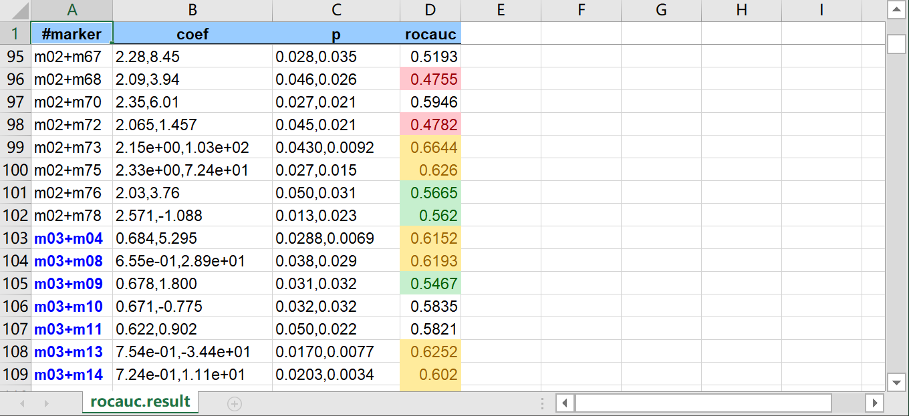

# `to` Command Documentation

The `to` command converts TSV (Tab-Separated Values) files into other formats (CSV, XLSX, Markdown).

## Usage

```bash
tva to <SUBCOMMAND> [options]
```

## Subcommands

* **`csv`**: Convert TSV to CSV.
* **`xlsx`**: Convert TSV to XLSX.
* **`md`**: Convert TSV to Markdown.

---

## `tva to csv`

Converts TSV files to Comma-Separated Values (CSV).

### Usage

```bash
tva to csv [input] [options]
```

### Options

* `-o <file>` / `--outfile <file>`: Output filename (default: stdout).
* `-d <char>` / `--delimiter <char>`: Specify the output delimiter (default: `,`).

### Examples

**Convert TSV to CSV:**

```bash
tva to csv docs/data/household.tsv
```

Output:

```csv
family,dob_child1,dob_child2,name_child1,name_child2
1,1998-11-26,2000-01-29,J,K
...
```

**Convert TSV to semicolon-separated values:**

```bash
tva to csv docs/data/household.tsv -d ";"
```

---

## `tva to xlsx`

Converts TSV files to Excel (XLSX) spreadsheets. Supports conditional formatting.

### Usage

```bash
tva to xlsx [input] [options]
```

### Options

* `-o <file>` / `--outfile <file>`: Output filename (default: `output.xlsx`).
* `-H` / `--header`: Treat the first line as a header.
* `--le <col:val>`: Format cells <= value.
* `--ge <col:val>`: Format cells >= value.
* `--bt <col:min:max>`: Format cells between min and max.
* `--str-in-fld <col:val>`: Format cells containing substring.

### Examples

**Convert TSV to XLSX:**

```bash
tva to xlsx docs/data/household.tsv -o output.xlsx
```

**Convert TSV to XLSX with formatting:**

```bash
tva to xlsx docs/data/rocauc.result.tsv -o output.xlsx \
    -H --le 4:0.5 --ge 4:0.6 --bt 4:0.52:0.58 --str-in-fld 1:m03
```



---

## `tva to md`

Converts a TSV file to a Markdown table, with support for column alignment and numeric formatting.

### Usage

```bash
tva to md [file] [options]
```

### Options

* `--num`: Right-align numeric columns automatically.
* `--fmt`: Format numeric columns (thousands separators, fixed decimals) and implies `--num`.
* `--digits <N>`: Set decimal precision for `--fmt` (default: 0).
* `--center <cols>` / `--right <cols>`: Manually set alignment for specific columns (e.g., `1,2-4`).

### Examples

**Basic markdown table:**

```bash
tva to md docs/data/household.tsv
```

Output:

```markdown
| family | dob_child1 | dob_child2 | name_child1 | name_child2 |
| ------ | ---------- | ---------- | ----------- | ----------- |
| 1      | 1998-11-26 | 2000-01-29 | J           | K           |
```

**Format numbers with commas and 2 decimal places:**

```bash
tva to md docs/data/us_rent_income.tsv --fmt --digits 2
```

Output:

```markdown
| GEOID | NAME       | variable |  estimate |    moe |
| ----: | ---------- | -------- | --------: | -----: |
|  1.00 | Alabama    | income   | 24,476.00 | 136.00 |
|  1.00 | Alabama    | rent     |    747.00 |   3.00 |
|  2.00 | Alaska     | income   | 32,940.00 | 508.00 |
|  2.00 | Alaska     | rent     |  1,200.00 |  13.00 |

...
```
