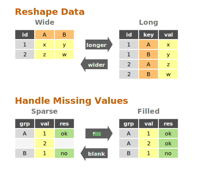

# Data Transformation Documentation

This document explains how to use the data transformation commands in `tva`: **`longer`**, *
*`wider`**, **`fill`**, **`blank`**, and **`transpose`**. These commands allow you to reshape and
restructure your data.

## Introduction

Data transformation involves changing the structure or values of a dataset. `tva` provides tools
for:

* **Pivoting**:
    * **`longer`**: Reshapes "wide" data (many columns) into "long" data (many rows).
    * **`wider`**: Reshapes "long" data into "wide" data.
* **Completion**:
    * **`fill`**: Fills missing values with previous non-missing values (LOCF) or constants.
    * **`blank`**: The inverse of `fill`; replaces repeated values with empty strings (sparsify).
* **Transposition**:
    * **`transpose`**: Swaps rows and columns (matrix transposition).



## `longer` (Wide to Long)

The `longer` command is designed to reshape "wide" data into a "long" format. "Wide" data often has
column names that are actually values of a variable. For example, a table might have columns like
`2020`, `2021`, `2022` representing years. `longer` gathers these columns into a pair of key-value
columns (e.g., `year` and `population`), making the data "longer" (more rows, fewer columns) and
easier to analyze.

### Basic Usage

```bash
tva longer [input_files...] --cols <columns> [options]
```

* **`--cols` / `-c`**: Specifies which columns to reshape. You can use column names, indices (
  1-based), or ranges (e.g., `3-5`, `wk*`).
* **`--names-to`**: The name of the new column that will store the original column headers (
  default: "name").
* **`--values-to`**: The name of the new column that will store the data values (default: "value").

## Examples

### 1. String Data in Column Names

Consider a dataset `docs/data/relig_income.tsv` where income brackets are spread across column
names:

```tsv
religion	<$10k	$10-20k	$20-30k
Agnostic	27	34	60
Atheist	12	27	37
Buddhist	27	21	30
```

To tidy this, we want to turn the income columns into a single `income` variable:

```bash
tva longer docs/data/relig_income.tsv --cols 2-4 --names-to income --values-to count
```

Output:

```tsv
religion	income	count
Agnostic	<$10k	27
Agnostic	$10-20k	34
Agnostic	$20-30k	60
...
```

### 2. Numeric Data in Column Names

The `docs/data/billboard.tsv` dataset records song rankings by week (`wk1`, `wk2`, etc.):

```tsv
artist	track	wk1	wk2	wk3
2 Pac	Baby Don't Cry	87	82	72
2Ge+her	The Hardest Part	91	87	92
```

We can gather the week columns and strip the "wk" prefix to get a clean number:

```bash
tva longer docs/data/billboard.tsv --cols "wk*" --names-to week --values-to rank --names-prefix "wk" --values-drop-na
```

* **`--names-prefix "wk"`**: Removes "wk" from the start of the column names (e.g., "wk1" -> "1").
* **`--values-drop-na`**: Drops rows where the rank is missing (empty).

Output:

```tsv
artist	track	week	rank
2 Pac	Baby Don't Cry	1	87
2 Pac	Baby Don't Cry	2	82
...
```

### 3. Many Variables in Column Names (Regex Extraction)

Sometimes column names contain multiple pieces of information. For example, in the
`docs/data/who.tsv` dataset, columns like `new_sp_m014` encode:

* `new`: new cases (constant)
* `sp`: diagnosis method
* `m`: gender (m/f)
* `014`: age group (0-14)

```tsv
country	iso2	iso3	year	new_sp_m014	new_sp_f014
Afghanistan	AF	AFG	1980	NA	NA
```

We can use **`--names-pattern`** with a regular expression to extract these parts into multiple
columns:

```bash
tva longer docs/data/who.tsv --cols "new_*" --names-to diagnosis gender age --names-pattern "new_?(.*)_(.)(.*)"
```

* **`--names-to`**: We provide 3 names for the 3 capture groups in the regex.
* **`--names-pattern`**: The regex `new_?(.*)_(.)(.*)` captures:
    1. `.*` (diagnosis, e.g., "sp")
    2. `.` (gender, e.g., "m")
    3. `.*` (age, e.g., "014")

Output:

```tsv
country	iso2	iso3	year	diagnosis	gender	age	value
Afghanistan	AF	AFG	1980	sp	m	014	NA
...
```

### 4. Splitting Column Names with a Separator

If column names are consistently separated by a character, you can use **`--names-sep`**.

Consider a dataset `docs/data/semester.tsv` where columns represent `year_semester`:

```tsv
student	2020_1	2020_2	2021_1
Alice	85	90	88
Bob	78	82	80
```

We can split the column names into two separate columns: `year` and `semester`.

```bash
tva longer docs/data/semester.tsv --cols 2-4 --names-to year semester --names-sep "_"
```

Output:

```tsv
student	year	semester	value
Alice	2020	1	85
Alice	2020	2	90
Alice	2021	1	88
Bob	2020	1	78
Bob	2020	2	82
Bob	2021	1	80
```

## `wider` (Long to Wide)

The `wider` command is the inverse of `longer`. It spreads a key-value pair across multiple columns,
increasing the number of columns and decreasing the number of rows. This is useful for creating
summary tables or reshaping data for tools that expect a matrix-like format.

### Basic Usage

```bash
tva wider [input_files...] --names-from <column> --values-from <column> [options]
```

* **`--names-from`**: The column containing the new column names.
* **`--values-from`**: The column containing the new column values.
* **`--id-cols`**: (Optional) Columns that uniquely identify each row. If not specified, all columns
  except `names-from` and `values-from` are used.
* **`--values-fill`**: (Optional) Value to use for missing cells (default: empty).
* **`--names-sort`**: (Optional) Sort the new column headers alphabetically.
* **`--op`**: (Optional) Aggregation operation (e.g., `sum`, `mean`, `count`, `last`). Default:
  `last`.

**Comparison: `stats` vs `wider`**

| Feature    | `stats` (Group By) | `wider` (Pivot)    |
|:-----------|:-------------------|:-------------------|
| **Goal**   | Summarize to rows  | Reshape to columns |
| **Output** | Long / Tall        | Wide / Matrix      |

### Example 1: US Rent and Income

Consider the dataset `docs/data/us_rent_income.tsv`:

```tsv
GEOID	NAME	variable	estimate	moe
01	Alabama	income	24476	136
01	Alabama	rent	747	3
02	Alaska	income	32940	508
02	Alaska	rent	1200	13
```

Here, `variable` contains the type of measurement (`income` or `rent`), and `estimate` contains the
value. To make this easier to compare, we can widen the data:

```bash
tva wider docs/data/us_rent_income.tsv --names-from variable --values-from estimate
```

Output:

```tsv
GEOID	NAME	moe	income	rent
01	Alabama	136	24476
01	Alabama	3		747
02	Alaska	508	32940
02	Alaska	13		1200
...
```

**Understanding ID Columns**:
By default, `wider` uses all columns *except* `names-from` and `values-from` as ID columns. In this
example, `GEOID`, `NAME`, and `moe` are treated as IDs.
Because `moe` (margin of error) is different for the `income` row (136) and the `rent` row (3),
`wider` keeps them as separate rows to preserve data.

To explicitly specify that only `GEOID` and `NAME` identify a row (and drop `moe`):

```bash
tva wider docs/data/us_rent_income.tsv --names-from variable --values-from estimate --id-cols GEOID,NAME
```

### Example 2: Capture-Recapture Data (Filling Missing Values)

The `docs/data/fish_encounters.tsv` dataset describes when fish were detected by monitoring
stations. Some fish are seen at some stations but not others.

```tsv
fish	station	seen
4842	Release	1
4842	I80_1	1
4842	Lisbon	1
4843	Release	1
4843	I80_1	1
4844	Release	1
```

If we widen this by `station`, we will have missing values for stations where a fish wasn't seen. We
can use **`--values-fill`** to fill these gaps with `0`.

```bash
tva wider docs/data/fish_encounters.tsv --names-from station --values-from seen --values-fill 0
```

Output:

```tsv
fish	Release	I80_1	Lisbon
4842	1	1	1
4843	1	1	0
4844	1	0	0
```

Without `--values-fill 0`, the missing cells would be empty strings (default).

## Complex Reshaping: Longer then Wider

Sometimes data requires multiple steps to be fully tidy. A common pattern is to make data longer to
fix column headers, and then wider to separate variables.

Consider the `docs/data/world_bank_pop.tsv` dataset (a subset):

```tsv
country	indicator	2000	2001
ABW	SP.URB.TOTL	42444	43048
ABW	SP.URB.GROW	1.18	1.41
AFG	SP.URB.TOTL	4436311	4648139
AFG	SP.URB.GROW	3.91	4.66
```

Here, years are in columns (needs `longer`) and variables are in the `indicator` column (needs
`wider`). We can pipe `tva` commands to solve this:

```bash
tva longer docs/data/world_bank_pop.tsv --cols 3-4 --names-to year --values-to value | \
tva wider --names-from indicator --values-from value
```

1. **`longer`**: Reshapes years (cols 3-4) into `year` and `value`.
2. **`wider`**: Takes the stream, uses `indicator` for new column names, and fills them with
   `value`. `country` and `year` automatically become ID columns.

Output:

```tsv
country	year	SP.URB.TOTL	SP.URB.GROW
ABW	2000	42444	1.18
ABW	2001	43048	1.41
AFG	2000	4436311	3.91
AFG	2001	4648139	4.66
```

## Handling Duplicates (Aggregation)

When widening data, you might encounter multiple rows for the same ID and name combination.

* **`tidyr`**: Often creates list-columns or requires an aggregation function (`values_fn`).
* **`tva`**: Supports aggregation via the **`--op`** argument.

By default (`--op last`), `tva` **overwrites** previous values with the **last observed value**.

However, you can specify an operation to aggregate these values, similar to `values_fn` in `tidyr`
or `crosstab` in `datamash`.

Supported operations: `count`, `sum`, `mean`, `min`, `max`, `first`, `last`, `median`, `mode`,
`stdev`, `variance`, etc.

### Example: Summing values

Example using `docs/data/warpbreaks.tsv`:

```tsv
wool	tension	breaks
A	L	26
A	L	30
A	L	54
...
```

If we want to sum the breaks for each wool/tension pair:

```bash
tva wider docs/data/warpbreaks.tsv --names-from wool --values-from breaks --op sum
```

Output:

```tsv	tension	A	B
L	110	47
M	68	62
H	81	96
```

(For A-L: 26 + 30 + 54 = 110)

### Example: Crosstab (Counting)

You can also use `wider` to create a frequency table (crosstab) by using `--op count`. In this case,
`--values-from` is optional. But to get a proper crosstab, you usually want to group by the other
factor (here, `tension`), so you should specify it as the ID column.

```bash
tva wider docs/data/warpbreaks.tsv --names-from wool --op count --id-cols tension
```

Output:

```tsv	tension	A	B
L	3	3
M	3	3
H	3	3
```

(Each combination appears 3 times in this dataset)

### Comparison: `stats` vs `wider` (Aggregation)

Both `tva stats` (if available) and `tva wider --op ...` can aggregate data, but they produce
different **structures**:

| Feature          | `tva stats` (Group By)       | `tva wider` (Pivot)             |
|:-----------------|:-----------------------------|:--------------------------------|
| **Goal**         | Summarize data into rows     | Reshape data into columns       |
| **Output Shape** | Long / Tall                  | Wide / Matrix                   |
| **Columns**      | Fixed (Group + Stat)         | Dynamic (Values become Headers) |
| **Best For**     | General summaries, reporting | Cross-tabulation, heatmaps      |

**Example**:
Data:

```tsv
Group   Category    Value
A       X           10
A       Y           20
B       X           30
B       Y           40
```

**`tva stats`** (Sum by Group):

```tsv
Group   Sum_Value
A       30
B       70
```

(Retains vertical structure)

**`tva wider`** (Sum, name from Category):

```tsv
Group   X   Y
A       10  20
B       30  40
```

(Spreads categories horizontally)

## `fill` (Fill Missing Values)

The `fill` command fills missing values in selected columns using the previous non-missing value (
Last Observation Carried Forward, or LOCF) or a constant. This is common in time-series data or
reports where values are only listed when they change.

### Basic Usage

```bash
tva fill [options]
```

* **`--field` / `-f`**: Columns to fill.
* **`--direction`**: Currently only `down` (default) is supported.
* **`--value` / `-v`**: If provided, fills with this constant value instead of the previous value.
* **`--na`**: String to consider as missing (default: empty string).

### Example: Filling Down

Input `docs/data/pet_names.tsv`:

```tsv
Pet	Name	Age
Dog	Rex	5
	Spot	3
Cat	Felix	2
	Tom	4
```

To fill the `Pet` column downwards:

```bash
tva fill -H -f Pet docs/data/pet_names.tsv
```

Output:

```tsv
Pet	Name	Age
Dog	Rex	5
Dog	Spot	3
Cat	Felix	2
Cat	Tom	4
```

### Example: Filling with Constant

To replace missing values with "Unknown":

```bash
tva fill -H -f Pet -v "Unknown" docs/data/pet_names.tsv
```

## `blank` (Sparsify / Inverse Fill)

The `blank` command replaces repeated values in selected columns with an empty string (or a custom
placeholder). This is the inverse of `fill` and is useful for creating human-readable reports where
repeated group labels are visually redundant.

### Basic Usage

```bash
tva blank [options]
```

* **`--field` / `-f`**: Columns to blank.
* **`--ignore-case` / `-i`**: Ignore case when comparing values.

### Example

Input `docs/data/blank_example.tsv`:

```tsv
Group	Item
A	1
A	2
B	1
```

Command:

```bash
tva blank -H -f Group docs/data/blank_example.tsv
```

Output:

```tsv
Group	Item
A	1
	2
B	1
```

## `transpose` (Matrix Transpose)

The `transpose` command swaps the rows and columns of a TSV file. It reads the entire file into
memory and performs a matrix transposition.

### Basic Usage

```bash
tva transpose [input_file] [options]
```

### Notes

* **Strict Mode**: `transpose` expects a rectangular matrix. All rows must have the same number of
  columns as the first row. If the file is jagged (rows have different lengths), the command will
  fail with an error.
* **Memory Usage**: Since it reads the whole file, be cautious with very large files.

### Examples

#### Transpose a table

Transpose `docs/data/relig_income.tsv`:

```bash
tva transpose docs/data/relig_income.tsv
```

Output (first 5 lines):

```tsv
religion	Agnostic	Atheist	Buddhist
<$10k	27	12	27
$10-20k	34	27	21
$20-30k	60	37	30
$30-40k	81	25	34
```

## Detailed Options

| Option                    | Description                                                                                            |
|:--------------------------|:-------------------------------------------------------------------------------------------------------|
| `--cols <cols>`           | **(Longer)** Columns to reshape. Supports indices (`1`, `1-3`), names (`year`), and wildcards (`wk*`). |
| `--names-to <names...>`   | **(Longer)** Name(s) for the new key column(s).                                                        |
| `--values-to <name>`      | **(Longer)** Name for the new value column.                                                            |
| `--names-prefix <str>`    | **(Longer)** String to remove from start of column names.                                              |
| `--names-sep <str>`       | **(Longer)** Separator to split column names.                                                          |
| `--names-pattern <regex>` | **(Longer)** Regex with capture groups for column names.                                               |
| `--values-drop-na`        | **(Longer)** Drop rows where value is empty.                                                           |
| `--names-from <col>`      | **(Wider)** Column for new headers.                                                                    |
| `--values-from <col>`     | **(Wider)** Column for new values.                                                                     |
| `--id-cols <cols>`        | **(Wider)** Columns identifying rows.                                                                  |
| `--values-fill <str>`     | **(Wider)** Fill value for missing cells.                                                              |
| `--names-sort`            | **(Wider)** Sort new column headers.                                                                   |
| `--op <op>`               | **(Wider)** Aggregation operation (`sum`, `mean`, `count`, etc.).                                      |
| `--field <cols>`          | **(Fill/Blank)** Columns to process.                                                                   |
| `--direction <dir>`       | **(Fill)** Direction to fill (`down` is default).                                                      |
| `--value <val>`           | **(Fill)** Constant value to fill with.                                                                |
| `--na <str>`              | **(Fill)** String to treat as missing (default: empty).                                                |
| `--ignore-case`           | **(Blank)** Ignore case when comparing values.                                                         |

## Comparison with R `tidyr`

| Feature          | `tidyr::pivot_longer`           | `tva longer`       |
|:-----------------|:--------------------------------|:-------------------|
| Basic pivoting   | `cols`, `names_to`, `values_to` | Supported          |
| Drop NAs         | `values_drop_na = TRUE`         | `--values-drop-na` |
| Prefix removal   | `names_prefix`                  | `--names-prefix`   |
| Separator split  | `names_sep`                     | `--names-sep`      |
| Regex extraction | `names_pattern`                 | `--names-pattern`  |

| Feature          | `tidyr::pivot_wider`            | `tva wider`                        |
|:-----------------|:--------------------------------|:-----------------------------------|
| Basic pivoting   | `names_from`, `values_from`     | Supported                          |
| ID columns       | `id_cols` (default: all others) | `--id-cols` (default: all others)  |
| Fill missing     | `values_fill`                   | `--values-fill`                    |
| Sort columns     | `names_sort`                    | `--names-sort`                     |
| Aggregation      | `values_fn`                     | `--op` (sum, mean, count, etc.)    |
| Multiple values  | `values_from = c(a, b)`         | Not supported (single column only) |
| Multiple names   | `names_from = c(a, b)`          | Not supported (single column only) |
| Implicit missing | `names_expand`, `id_expand`     | Not supported                      |
