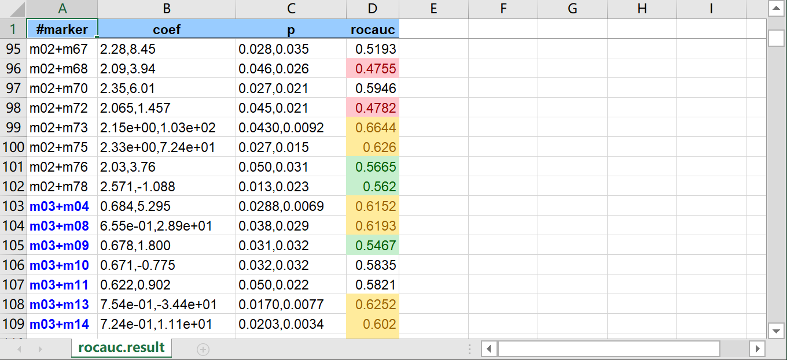

# Formatting & Utilities Documentation

This document explains how to use the utility commands in `tva`: **`check`**, **`from`**, **`to`**, **`md`**, **`nl`**, and **`keep-header`**.

## `check`

Checks TSV file structure for consistent field counts.

### Usage

```bash
tva check [files...]
```

It validates that every line in the file has the same number of fields as the first line. If a mismatch is found, it reports the error line and exits with a non-zero status.

### Examples

Check a single file:
```bash
tva check docs/data/household.tsv
```
Output:
```
2 lines, 5 fields
```

## `from`

Converts other formats (CSV, XLSX) to TSV.

### Usage

```bash
tva from <SUBCOMMAND> [options]
```

### Subcommands

*   **`csv`**: Convert CSV to TSV.
    *   `tva from csv [input] [-o output] [-d delimiter]`
*   **`xlsx`**: Convert XLSX to TSV.
    *   `tva from xlsx [input] [--sheet name] [--list-sheets]`

### Examples

Convert a CSV file to TSV:
```bash
tva from csv docs/data/input.csv > output.tsv
```

Convert an Excel sheet to TSV:
```bash
tva from xlsx docs/data/formats.xlsx --sheet "Introduction" > output.tsv
```

## `to`

Converts TSV to other formats (CSV, XLSX).

### Usage

```bash
tva to <SUBCOMMAND> [options]
```

### Subcommands

*   **`csv`**: Convert TSV to CSV.
    *   `tva to csv [input] [-o output] [-d delimiter]`
*   **`xlsx`**: Convert TSV to XLSX.
    *   `tva to xlsx [input] [-o output.xlsx] [-H] [--le col:val] ...`

### Examples

Convert a TSV file to CSV:
```bash
tva to csv docs/data/household.tsv > output.csv
```

Convert a TSV file to XLSX with formatting:
```bash
tva to xlsx docs/data/household.tsv -o output.xlsx -H --le 1:2
```

Convert a TSV file to XLSX with multiple formatting rules:
```bash
tva to xlsx docs/data/rocauc.result.tsv -o output.xlsx \
    -H --le 4:0.5 --ge 4:0.6 --bt 4:0.52:0.58 --str-in-fld 1:m03
```



## `md`

Converts a TSV file to a Markdown table.

### Usage

```bash
tva md [file] [options]
```

Options:
*   `--num`: Right-align numeric columns.
*   `--fmt`: Format numeric columns (thousands separators, fixed decimals) and implies `--num`.
*   `--digits <N>`: Set decimal precision for `--fmt` (default: 0).
*   `--center <cols>` / `--right <cols>`: Manually set alignment for specific columns.

### Examples

Basic markdown table:
```bash
tva md docs/data/household.tsv
```

Output:
```markdown
| family | dob_child1 | dob_child2 | name_child1 | name_child2 |
| ------ | ---------- | ---------- | ----------- | ----------- |
| 1      | 1998-11-26 | 2000-01-29 | J           | K           |
```

Format numbers with commas and 2 decimal places:
```bash
tva md data.tsv --fmt --digits 2
```

## `nl`

Adds line numbers to TSV rows.

### Usage

```bash
tva nl [files...] [options]
```

Options:
*   `-H` / `--header`: Treat the first line as a header. The header line is not numbered, and a "line" column is added to the header.
*   `-s <STR>` / `--header-string <STR>`: Set the header name for the line number column (implies `-H`).
*   `-n <N>` / `--start-number <N>`: Start numbering from N (default: 1).

### Examples

Add line numbers (no header logic):
```bash
tva nl docs/data/household.tsv
```

Output:
```tsv
1	family	dob_child1	dob_child2	name_child1	name_child2
2	1	1998-11-26	2000-01-29	J	K
```

Add line numbers with header awareness:
```bash
tva nl -H docs/data/household.tsv
```

Output:
```tsv
line	family	dob_child1	dob_child2	name_child1	name_child2
1	1	1998-11-26	2000-01-29	J	K
```

## `keep-header`

Executes a shell command on the body of a TSV file, preserving the header.

### Usage

```bash
tva keep-header [files...] -- <command> [args...]
```

The first line of the first input file is printed immediately. The remaining lines (and all lines from subsequent files) are piped to the specified command. The output of the command is then printed.

### Examples

Sort a file while keeping the header at the top:
```bash
tva keep-header data.tsv -- sort
```

Grep for a pattern but keep the header:
```bash
tva keep-header docs/data/world_bank_pop.tsv -- grep "AFG"
```

Output:
```tsv
country	indicator	2000	2001
AFG	SP.URB.TOTL	4436311	4648139
AFG	SP.URB.GROW	3.91	4.66
```
